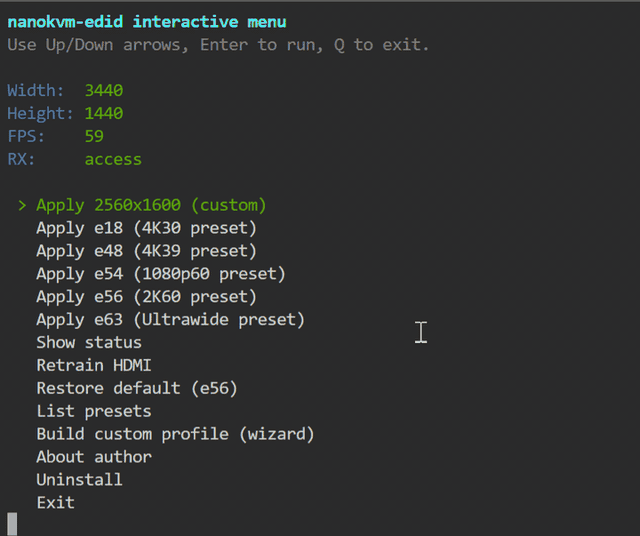

<h1 align="left">NanoKVM Pro EDID Tool</h1>

<p align="left">
  <a href="https://github.com/vadlike/NanoKVM-Pro-EDID/releases/latest">
    
  </a>
  
  
  <a href="https://wiki.sipeed.com/hardware/en/kvm/NanoKVM_Pro/introduction.html">
    
  </a>
  <a href="https://github.com/vadlike">
    
  </a>
</p>

Interactive EDID tool for NanoKVM Pro with a simple terminal menu.

This repository provides a ready-to-use package for installing, switching, building, and removing EDID profiles on NanoKVM Pro.

## Demo


## Quick Start
```bash
curl -fsSL "https://raw.githubusercontent.com/vadlike/NanoKVM-Pro-EDID/refs/heads/main/install.sh?nocache=1" | sudo bash
```

## Menu Actions
- `Apply 2560x1600 (custom)`
- `Apply e18 (4K30 preset)`
- `Apply e48 (4K39 preset)`
- `Apply e54 (1080p60 preset)`
- `Apply e56 (2K60 preset)`
- `Apply e63 (Ultrawide preset)`
- `Show status`
- `Retrain HDMI`
- `Restore default (e56)`
- `List presets`
- `Build custom profile (wizard)`
- `About author`

## CLI Commands
```bash
nanokvm-edid menu
nanokvm-edid status
nanokvm-edid list
nanokvm-edid build
nanokvm-edid apply e18
nanokvm-edid apply /path/to/custom.bin
nanokvm-edid retrain
nanokvm-edid restore
nanokvm-edid about
```

## Presets
- `e18` -> `/kvmcomm/edid/E18-4K30FPS.bin`
- `e48` -> `/kvmcomm/edid/E48-4K39FPS.bin`
- `e54` -> `/kvmcomm/edid/E54-1080P60FPS.bin`
- `e56` -> `/kvmcomm/edid/E56-2K60FPS.bin`
- `e58` -> `/kvmcomm/edid/E58-4K16-10.bin`
- `e63` -> `/kvmcomm/edid/E63-Ultrawide.bin`
- `2560x1600` -> `/opt/nanokvm-edid/profiles/e18-2560x1600.bin`

## Notes
- EDID write through `/proc/lt6911_info/edid` may be unstable on some firmware; tool retries with HDMI power cycle.
- Requested refresh rate in EDID is not always guaranteed by GPU, cable, and source side.
- Use `NO_COLOR=1` to disable colored output.

## Author
<p align="left">
  <a href="https://github.com/vadlike">
    
  </a>
  <a href="https://github.com/vadlike/NanoKVM-Pro-EDID/tree/main">
    
  </a>
</p>
